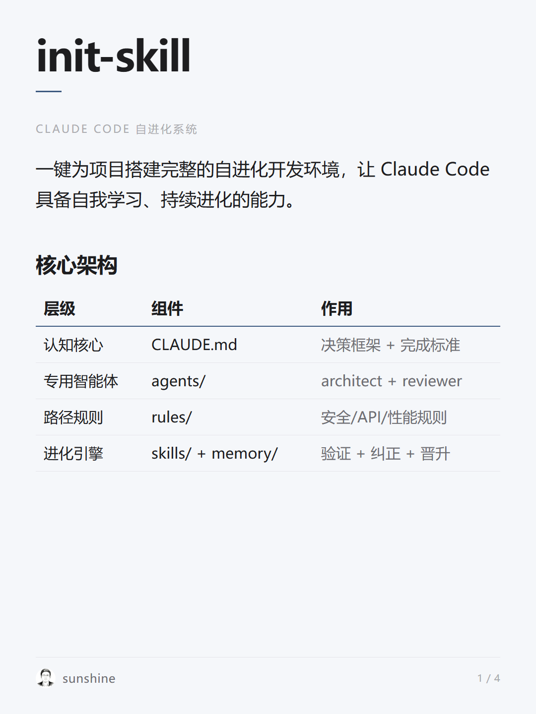
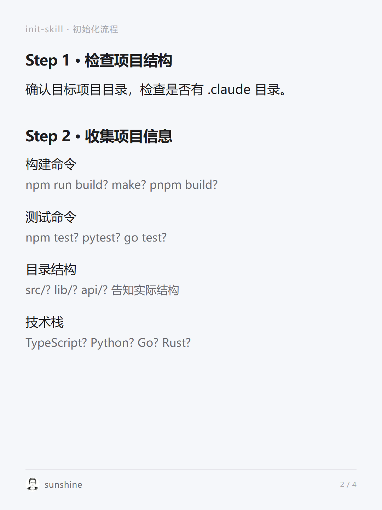
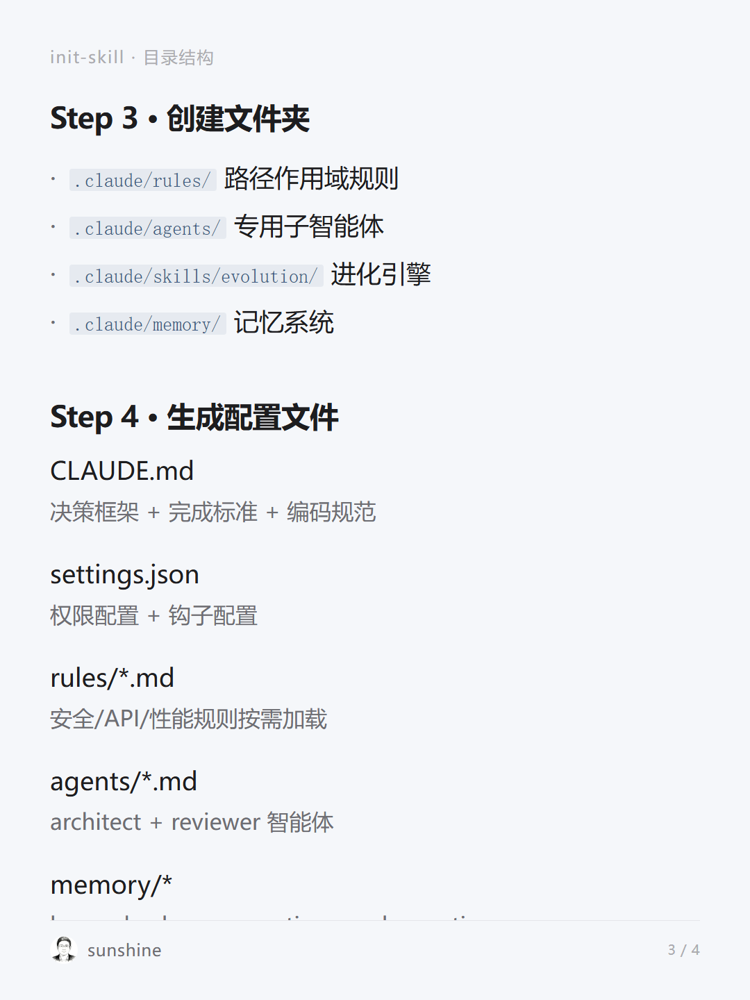
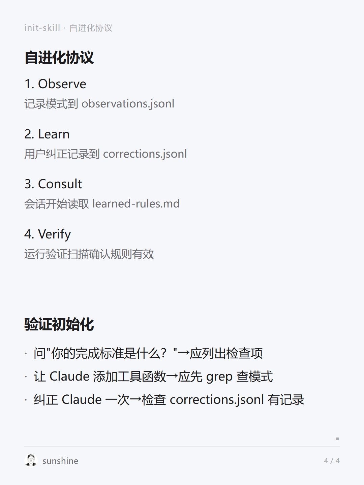

# init-skill

> Claude Code 自进化系统初始化技能

一键为项目搭建完整的自进化开发环境，让 Claude Code 具备自我学习、持续进化的能力。

## 核心架构

系统由四层组成：

| 层级 | 组件 | 作用 |
|-----|------|-----|
| 认知核心 | CLAUDE.md | 决策框架 + 完成标准 + 编码规范 |
| 专用子智能体 | agents/ | architect(规划) + reviewer(审查) |
| 路径作用域规则 | rules/ | 安全/API/性能规则按需加载 |
| 进化引擎 | skills/evolution + memory/ | 验证扫描 + 纠正捕获 + 自动晋升 |

## 架构预览






## 初始化流程

### Step 1: 检查项目结构

首先确认目标项目目录，检查是否有 `.claude` 目录。

### Step 2: 收集项目信息

向用户确认以下信息：

- **构建命令**：npm run build? make? pnpm build?
- **测试命令**：npm test? pytest? go test?
- **目录结构**：src/? lib/? api/? 告知实际结构
- **技术栈**：TypeScript? Python? Go? Rust?

### Step 3: 创建文件夹结构

```
.claude/
├── rules/              # 路径作用域规则
├── agents/             # 专用子智能体
├── skills/
│   ├── evolution/      # 进化引擎
│   ├── evolve/         # 进化审计命令
│   ├── review/         # 提交前审查
│   ├── boot/           # 会话预热
│   └── fix-issue/      # GitHub Issue 修复
└── memory/
    ├── learned-rules.md    # 已学规则
    ├── corrections.jsonl   # 用户纠正记录
    └── observations.jsonl  # 已验证发现
```

### Step 4: 生成配置文件

- **CLAUDE.md** - 认知核心（决策框架、完成标准、编码规范）
- **settings.json** - 权限配置 + 钩子配置
- **rules/*.md** - 安全/API/性能规则按需加载
- **agents/*.md** - architect + reviewer 智能体
- **memory/* ** - 记忆系统文件

## 自进化协议

```
┌─────────────┐     ┌─────────────┐     ┌─────────────┐     ┌─────────────┐
│   Observe   │ ──▶ │    Learn    │ ──▶ │   Consult   │ ──▶ │   Verify    │
└─────────────┘     └─────────────┘     └─────────────┘     └─────────────┘
      │                   │                   │                   │
      ▼                   ▼                   ▼                   ▼
 observations       corrections        learned-rules        验证扫描
    .jsonl            .jsonl               .md              确认有效
```

1. **Observe** - 记录模式到 `observations.jsonl`
2. **Learn** - 用户纠正记录到 `corrections.jsonl`
3. **Consult** - 会话开始读取 `learned-rules.md`
4. **Verify** - 运行验证扫描确认规则有效

## 验证初始化

初始化完成后，验证是否生效：

1. 问 Claude："你的完成标准是什么？" → 应列出检查项
2. 让 Claude 添加工具函数 → 应先 grep 查模式
3. 纠正 Claude 一次 → 检查 `corrections.jsonl` 有记录

## 使用方式

在项目目录启动 Claude Code：

```bash
cd your-project
# Claude 自动加载 CLAUDE.md 中的决策框架
# SessionStart 钩子触发验证扫描
# 用户纠正自动记录到 corrections.jsonl
# 第二次相同纠正自动晋升到 learned-rules.md
```

## 文件说明

```
init-skill/
├── SKILL.md                # 本技能文档
├── README.md               # 项目说明
├── references/             # 模板文件
│   ├── CLAUDE.md           # 认知核心模板
│   ├── settings.json       # 权限配置模板
│   ├── rule-security.md    # 安全规则模板
│   ├── rule-api-design.md  # API设计规则模板
│   ├── rule-performance.md # 性能规则模板
│   ├── agent-architect.md  # 架构师智能体模板
│   ├── agent-reviewer.md   # 审查智能体模板
│   └── skill-evolution.md  # 进化引擎模板
└── assets/                 # 图片资源
    ├── init_skill_1.png
    ├── init_skill_2.png
    ├── init_skill_3.png
    └── init_skill_4.png
```

## License

MIT

## 相关链接

- [Claude Code 官方文档](https://docs.anthropic.com/claude-code)
- [GitHub 仓库](https://github.com/cyhzzz/init-skill)
